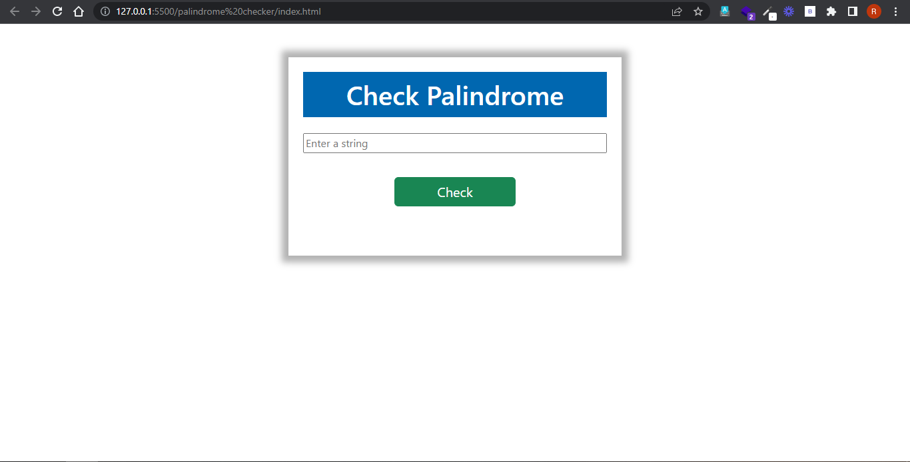
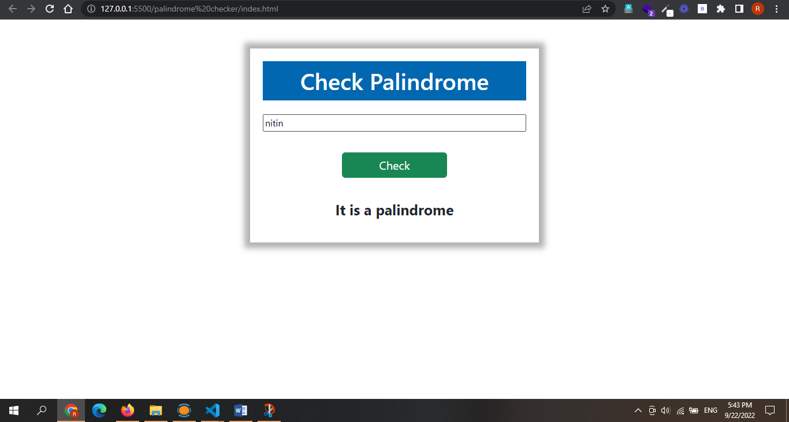

# JS ASSIGNMENT

Palindrome checker

### default:

### output:

It took me around 2.5 hours to complete it.

Technology Used:

- HTML
- CSS
- JAVASCRIPT

Live Demo: [Link](https://palindrome-checker.netlify.app/)
